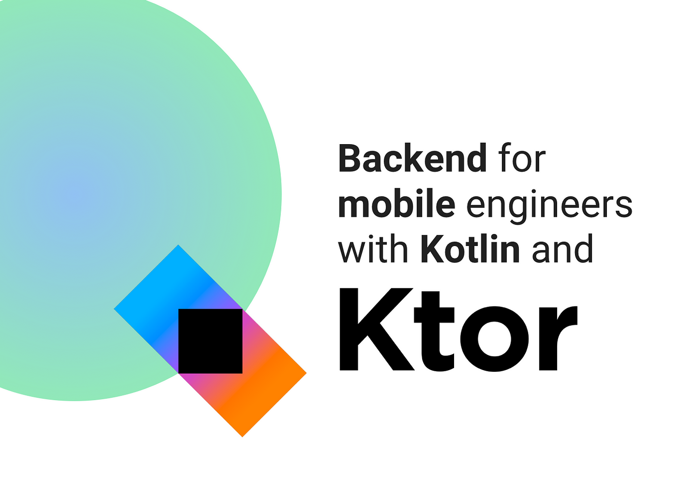
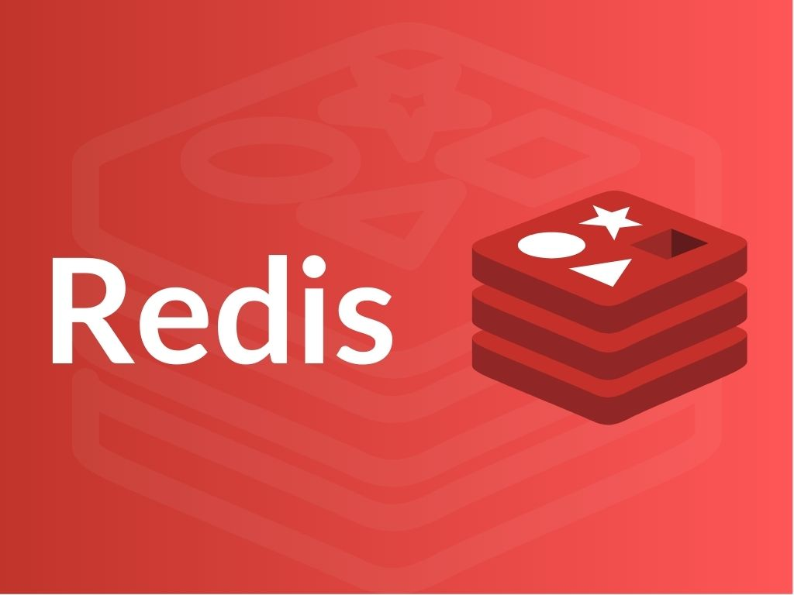
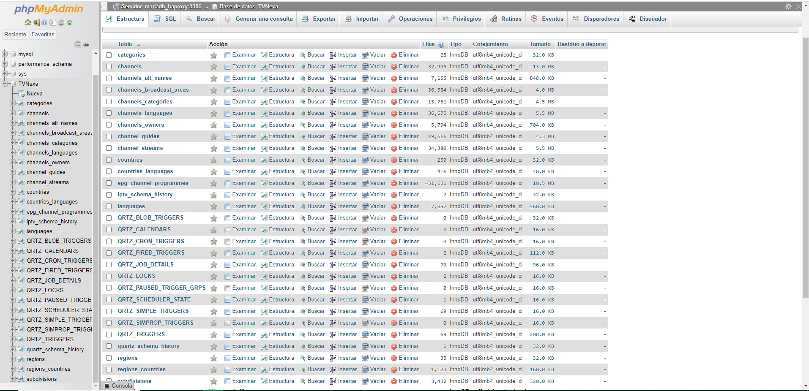
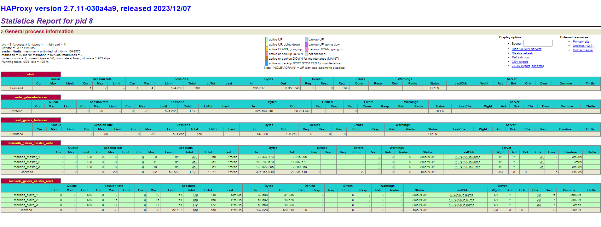
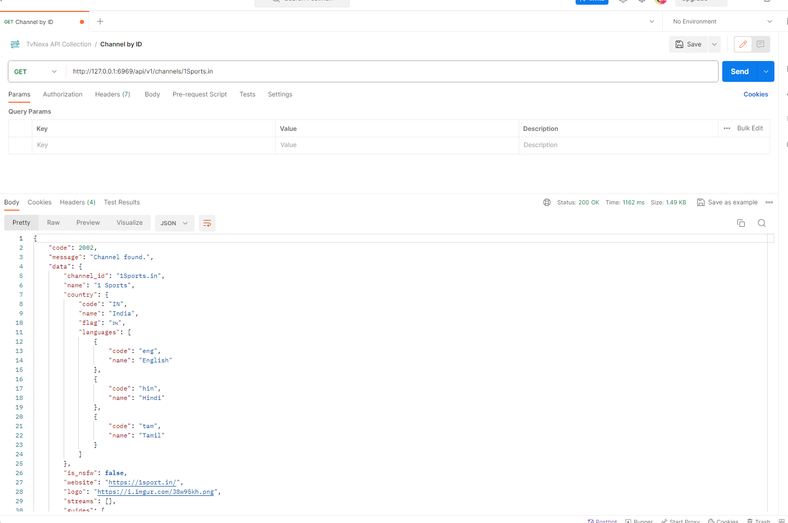
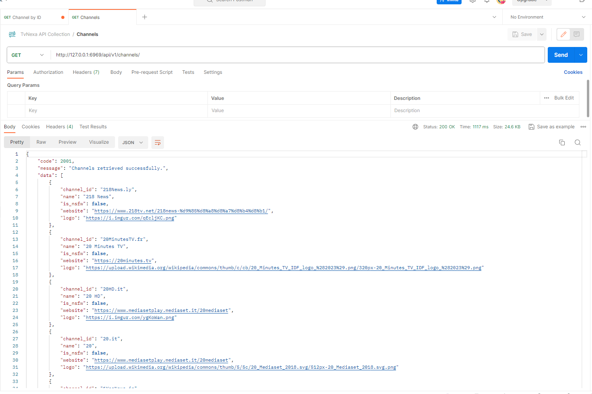

# TVNexa: 🌐 Bringing the World to Your Screen! 📺

TVNexa 🌐 is an innovative online television platform that allows you to explore a diverse universe of television channels from around the world. With access to a wide range of IPTVs, TVNexa offers you the freedom to tune in and enjoy content from countries across the globe. Immerse yourself in a unique streaming experience where you can discover exciting programs and diverse cultures, all from the comfort of your device. TVNexa: Your gateway to the world of IPTVs and global television. 📺✨

  
  
  
  
  
  
  

## ✨ Features

* **📺 Extensive Channel Library:** Explore an extensive collection of television channels from diverse countries and regions, offering an array of entertainment options.
* **🌟 Diverse Content:** Immerse yourself in a rich array of programs encompassing various languages, genres, and categories, catering to diverse audience preferences.
* **📋 Integration of Guide Information:** TVNexa seamlessly integrates detailed program information from electronic program guides (EPG) for thousands of TV channels, ensuring an enriched viewing experience.
* **💾 Efficient Data Storage and Retrieval:**
  * **⏰ Quartz Jobs:** Utilizes Quartz Jobs to seamlessly integrate and manage data retrieval processes, ensuring timely and accurate information updates.
  * **🔒 MariaDB Galera with Jetbrains Exposed:** Stores integrated data efficiently in a secure MariaDB Galera cluster using Jetbrains Exposed for robust data handling and management.
  * **🚀 Optimized API with Ktor and Redis Cluster:** Develops a highly optimized API utilizing the Ktor framework for rapid and efficient data retrieval, supported by Redis Cluster as a caching system to enhance performance.

  
  

## 🔄 Integration Process

TVNexa integrates comprehensive electronic program guide (EPG) data seamlessly into its platform. This integration process is handled by Jobs managed by Quartz, a robust job scheduling framework known for its reliability and scalability. These Quartz Jobs efficiently retrieve and store information in a MariaDB Galera cluster utilizing Jetbrains Exposed for streamlined data management.

Additionally, TVNexa has developed an API powered by the Ktor framework, ensuring high-performance and rapid access to stored information. This API utilizes Redis Cluster as a caching system, enabling lightning-fast data retrieval from the MariaDB Galera storage.

  

## 📊 Data Ingestion in TVNexa

The data ingestion process in TVNexa is a fundamental component designed to keep the platform updated and enriched with relevant information from various external sources. This operation is structured into a series of Jobs configured to fulfill specific responsibilities, ensuring the correct collection, integration, and storage of data.

### 🏗️ Ingestion Architecture

#### 🎯 Definition of Specialized Jobs

Each Job within the ingestion process has a clearly defined responsibility and sets logical constraints to ensure information coherence. For instance, the Job responsible for channel ingestion requires the successful execution of other specific Jobs.

This guarantees that essential information, like languages, categories, and subdivisions, is previously stored before channel ingestion, ensuring data integrity and coherence.

#### ⏰ Execution Regularity

Ingestion Jobs are configured to run at different time intervals based on the criticality and update frequency of data from external endpoints. This strategy ensures that the platform's information stays up-to-date efficiently and timely.

## 🗄️ Storage Environment

### Usage of MariaDB Galera Clusters

The TVNexa platform features two distinct storage environments:

* **Read Cluster:** Utilized by the information reading component, primarily via the Ktor API. This environment allows access to data in read-only mode to provide information to end-users quickly and efficiently.

* **Write Cluster:** Employed by the ingestion component to store data from the Jobs. This part of the system handles write operations to update and enrich the database with the most recent information obtained from external endpoints.

  

## 🚀 Benefits of the Ingestion Process

* **Maintaining Updated Data:** Ensures that the information provided to users is current, accurate, and comprehensive.
* **Data Integrity:** Guarantees coherence and quality of stored data by setting dependencies between Jobs and verifying prerequisites before critical information ingestion.
* **Optimization of User Experience:** Allows users to access updated and relevant information through the Ktor API with fast and efficient response times.

The ingestion process in TVNexa is meticulously configured to ensure continuous information updates and provide an optimal and enriching user experience.

## 🛠️ Technical Stack

* **Quartz Jobs:** Framework renowned for its reliability and scalability in managing job scheduling processes.
* **MariaDB Galera with Jetbrains Exposed:** Utilizes Jetbrains Exposed, an SQL library, to manage data storage and retrieval within a MariaDB Galera cluster.
* **Ktor Framework:** Empowers the highly optimized API for rapid and efficient data retrieval. 💡
* **Redis Cluster:** Implements Redis Cluster as a caching system for optimizing data retrieval through the API. 🔄

## 📊 Data Sources and APIs

TVNexa integrates data from various sources to provide a comprehensive television viewing experience. The platform accesses and integrates detailed information from:

* **📺 Channels:** Access detailed channel information from IPTV sources.
* **📡 Streams:** Retrieve streaming URLs for channels and additional metadata.
* **📋 Guides:** Obtain guides for channels, including site domain, site ID, site name, and guide language.
* **🗂️ Categories, Languages, Countries, Subdivisions, Regions:** Access additional datasets for categories, languages, countries, subdivisions, and regions.

For more information on the data sources, refer to the [GitHub repository](https://github.com/iptv-org/database).

## Running Applications as Docker containers.

### Rake Tasks

The available tasks are detailed below (rake --task)

| Task                                       | Description                                                                                                                                                              |
|-------------------------------------------- |--------------------------------------------------------------------------------------------------------------------------------------------------------------------------|
| `tvnexa:login`                             | Authentication with existing credentials using Docker.                                                                                                                     |
| `tvnexa:cleaning_environment_task`          | Environment cleaning: removes Docker images and volumes.                                                                                                                   |
| `tvnexa:status`                            | Shows the status of containers using `docker-compose ps`.                                                                                                                  |
| `tvnexa:deploy`                            | Deploys platform containers and launches all services and daemons necessary for proper functionality.                                                                      |
| `tvnexa:undeploy`                          | Undeploys platform services using `docker-compose down -v`.                                                                                                                |
| `tvnexa:check_docker_task`                 | Checks Docker and Docker Compose availability in the system PATH, showing their versions.                                                                                   |
| `tvnexa:galera:check_deployment_file`      | Checks the existence of the MariaDB Galera Cluster deployment file.                                                                                                        |
| `tvnexa:galera:start`                      | Starts MariaDB Galera Cluster and HAProxy containers.                                                                                                                       |
| `tvnexa:galera:stop`                       | Stops MariaDB Galera Cluster and HAProxy containers.                                                                                                                        |
| `tvnexa:redis:check_deployment_file`       | Checks the existence of the Redis Cluster deployment file.                                                                                                                  |
| `tvnexa:redis:start`                       | Starts and configures Redis Cluster containers.                                                                                                                              |
| `tvnexa:redis:stop`                        | Stops Redis Cluster containers.                                                                                                                                             |
| `tvnexa:platform:check_deployment_file`    | Checks the existence of the platform deployment file.                                                                                                                        |
| `tvnexa:platform:start`                    | Starts platform Hotspot JVM containers.                                                                                                                                     |
| `tvnexa:platform:stop`                     | Stops platform Hotspot JVM containers.                                                                                                                                       |
| `tvnexa:platform:build_image`              | Builds Docker images based on Hotspot JVM for specific microservices, uploads them to Docker Hub, and shows the list of available images.                                 |

To start the platform make sure you have Ruby installed, go to the root directory of the project and run the rake deploy task, this task will carry out a series of preliminary checks, discard images and volumes that are no longer necessary and also proceed to download all the images and the initialization of the containers.

## Containers Ports

In this table, you can view the ports assigned to each service for accessing web tools or other monitoring purposes.

| Service                | Port(s)                                      | Description                                      |
|------------------------|----------------------------------------------|--------------------------------------------------|
| haproxy                | 9090 (HAProxy stats), 8404                   | Load balancer for API services                   |
| ftp_repository         | 20, 21, 22, 40000-40009 (passive mode range) | FTP configuration repository                    |
| tv_nexa_api_service_1  | (No specific ports exposed)                  | API service #1                                   |
| tv_nexa_api_service_2  | (No specific ports exposed)                  | API service #2                                   |
| tv_nexa_api_service_3  | (No specific ports exposed)                  | API service #3                                   |
| redis-node-1           | 6379 (6379), 16379                           | Redis Node 1                                    |
| redis-node-2           | 6380 (6380), 16380                           | Redis Node 2                                    |
| redis-node-3           | 6381 (6381), 16381                           | Redis Node 3                                    |
| redis-node-4           | 6382 (6382), 16382                           | Redis Node 4                                    |
| redis-node-5           | 6383 (6383), 16383                           | Redis Node 5                                    |
| redis-node-6           | 6384 (6384), 16384                           | Redis Node 6                                    |
| redis-node-7           | 6385 (6385), 16385                           | Redis Node 7                                    |
| redis-node-8           | 6386 (6386), 16386                           | Redis Node 8                                    |
| mariadb_master_1       | (No specific ports exposed)                  | MariaDB Master Node 1                           |
| mariadb_master_2       | (No specific ports exposed)                  | MariaDB Master Node 2                           |
| mariadb_master_3       | (No specific ports exposed)                  | MariaDB Master Node 3                           |
| mariadb_slave_1        | (No specific ports exposed)                  | MariaDB Slave Node 1                            |
| mariadb_slave_2        | (No specific ports exposed)                  | MariaDB Slave Node 2                            |
| mariadb_slave_3        | (No specific ports exposed)                  | MariaDB Slave Node 3                            |
| mariadb_haproxy        | 8404, 3306, 3307                             | HAProxy for MariaDB Cluster                     |
| mariadb_web_admin      | 8081                                         | phpMyAdmin for MariaDB Cluster                  |

## Dependency Overview: Key Components in Project Infrastructure

The following is a summary of key dependencies used in the infrastructure of our project. These libraries and modules play fundamental roles in various areas, from server authentication to integration with Quartz for scheduled tasks. Below is a detailed breakdown of each dependency and its specific function within the context of our project

| Dependency                                           | Explanation                                                                                          |
|------------------------------------------------------|------------------------------------------------------------------------------------------------------|
| `io.ktor:ktor-server-auth-jvm`                       | Ktor server authentication module for the JVM.                                                       |
| `io.ktor:ktor-server-core-jvm`                       | Ktor server core module for the JVM.                                                                  |
| `io.ktor:ktor-server-auth-jwt-jvm`                   | Ktor server JSON Web Token (JWT) authentication module for the JVM.                                    |
| `io.ktor:ktor-server-content-negotiation-jvm`        | Ktor server content negotiation module for the JVM.                                                   |
| `io.ktor:ktor-server-call-logging-jvm`               | Ktor server call logging module for the JVM.                                                          |
| `io.ktor:ktor-server-call-id-jvm`                    | Ktor server call ID module for the JVM.                                                               |
| `io.ktor:ktor-server-conditional-headers-jvm`        | Ktor server conditional headers module for the JVM.                                                   |
| `io.ktor:ktor-server-compression-jvm`                | Ktor server response compression module for the JVM.                                                  |
| `io.ktor:ktor-server-caching-headers-jvm`            | Ktor server caching headers module for the JVM.                                                       |
| `io.ktor:ktor-serialization-jackson`                 | Ktor serialization module using Jackson for the JVM.                                                  |
| `io.ktor:ktor-serialization-kotlinx-json-jvm`        | Ktor serialization module using kotlinx.serialization and JSON for the JVM.                            |
| `io.ktor:ktor-server-netty-jvm`                      | Ktor server Netty module for the JVM.                                                                 |
| `io.ktor:ktor-server-status-pages-jvm`              | Ktor server status pages module for the JVM.                                                          |
| `io.ktor:ktor-server-request-validation`             | Ktor server request validation module for the JVM.                                                    |
| `redis.clients:jedis`                                | Redis Java client designed for performance and ease of use.                                           |
| `com.google.code.gson:gson`                          | Google Gson library for JSON serialization and deserialization.                                       |
| `io.ktor:ktor-server-tests-jvm`                     | Ktor server tests module for the JVM, used for testing Ktor applications.                              |
| `io.insert-koin:koin-ktor`                           | Koin integration for Ktor.                                                                           |
| `io.insert-koin:koin-logger-slf4j`                   | Koin logger integration with SLF4J.                                                                  |
| `com.sksamuel.hoplite:hoplite-core`                  | A boilerplate-free Kotlin config library for loading configuration files as data classes.           |
| `com.sksamuel.hoplite:hoplite-yaml`                  | Hoplite YAML support for configuration.                                                              |
| `org.jetbrains.exposed:exposed-core`                | Exposed ORM core module.                                                                             |
| `org.jetbrains.exposed:exposed-dao`                 | Exposed DAO module.                                                                                 |
| `org.jetbrains.exposed:exposed-jdbc`                | Exposed JDBC module.                                                                                |
| `org.jetbrains.exposed:exposed-java-time`           | Exposed Java Time extension.                                                                        |
| `org.mariadb.jdbc:mariadb-java-client`              | MariaDB Java client.                                                                               |
| `com.zaxxer:HikariCP`                               | HikariCP connection pool.                                                                          |
| `org.flywaydb:flyway-core`                          | Flyway database migration library - core.                                                           |
| `org.flywaydb:flyway-mysql`                         | Flyway database migration library - MySQL extension.                                                |
| `com.h2database:h2`                                 | H2 Database Engine.                                                                                |
| `commons-net:commons-net`                            | Apache Commons Net library.                                                                        |
| `commons-io:commons-io`                              | Apache Commons IO library.                                                                         |
| `ch.qos.logback:logback-classic`                    | Logback Classic module for logging.                                                                |
| `com.fasterxml.jackson.module:jackson-module-kotlin`     | Jackson module for Kotlin support.                                                                   |
| `com.fasterxml.jackson.dataformat:jackson-dataformat-xml`| Jackson data format module for XML support.                                                          |
| `org.quartz-scheduler:quartz`                            | Quartz scheduler library for CRON jobs.                                                              |

This collection of dependencies forms the backbone of our infrastructure, providing essential functionalities for development, communication, data persistence, and scheduling periodic tasks in the project.

## Some screenshots

As follow, I include some images that help us to understand the performance of each part of system

## Contribution
Contributions to TvNexa are highly encouraged! If you're interested in adding new features, resolving bugs, or enhancing the project's functionality, please feel free to submit pull requests.

## Credits
TvNexa Architecture is developed and maintained by Sergio Sánchez Sánchez (Dream Software). Special thanks to the open-source community and the contributors who have made this project possible. If you have any questions, feedback, or suggestions, feel free to reach out at dreamsoftware92@gmail.com.

 ## Visitors Count
 
 ## Please Share & Star the repository to keep me motivated.
  
