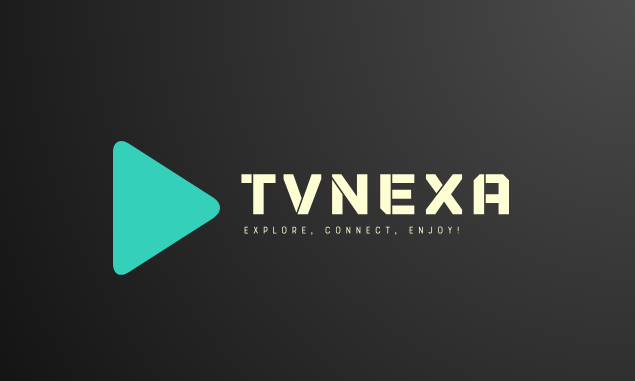

# TVNexa: 🌐 Bringing the World to Your Screen! 📺

TVNexa 🌐 is an innovative online television platform that allows you to explore a diverse universe of television channels from around the world. With access to a wide range of IPTVs, TVNexa offers you the freedom to tune in and enjoy content from countries across the globe. Immerse yourself in a unique streaming experience where you can discover exciting programs and diverse cultures, all from the comfort of your device. TVNexa: Your gateway to the world of IPTVs and global television. 📺✨

  
  
  

## Features

* **Extensive Channel Library:** Explore a vast collection of television channels from various countries and regions.
* **Diverse Content:** Dive into a rich array of programs, encompassing multiple languages, genres, and categories.
* **Integration of Guide Information:** TVNexa integrates detailed program information from electronic program guides (EPG) for thousands of TV channels.
* **Efficient Data Storage and Retrieval:**
  * **Quartz Jobs:** Utilizes Quartz Jobs for seamless integration and management of data retrieval processes.
  * **MariaDB Galera with Jetbrains Exposed:** Stores integrated data efficiently in a MariaDB Galera cluster using Jetbrains Exposed for robust data handling and management.
  * **Optimized API with Ktor and Redis Cluster:** Develops a highly optimized API utilizing Ktor framework for rapid and efficient data retrieval, supported by Redis Cluster as a caching system. 🚀

## Integration Process

TVNexa integrates comprehensive electronic program guide (EPG) data seamlessly into its platform. This integration process is handled by Jobs managed by Quartz, a robust job scheduling framework known for its reliability and scalability. These Quartz Jobs efficiently retrieve and store information in a MariaDB Galera cluster utilizing Jetbrains Exposed for streamlined data management.

Additionally, TVNexa has developed an API powered by the Ktor framework, ensuring high-performance and rapid access to stored information. This API utilizes Redis Cluster as a caching system, enabling lightning-fast data retrieval from the MariaDB Galera storage.

## Technical Stack

* **Quartz Jobs:** Framework renowned for its reliability and scalability in managing job scheduling processes.
* **MariaDB Galera with Jetbrains Exposed:** Utilizes Jetbrains Exposed, an SQL library, to manage data storage and retrieval within a MariaDB Galera cluster.
* **Ktor Framework:** Empowers the highly optimized API for rapid and efficient data retrieval. 💡
* **Redis Cluster:** Implements Redis Cluster as a caching system for optimizing data retrieval through the API. 🔄

##Data Sources and APIs

TVNexa integrates data from various sources to provide a comprehensive television viewing experience. The platform accesses and integrates detailed information from:

* **Channels:** Access detailed channel information from IPTV sources.
* **Streams:** Retrieve streaming URLs for channels and additional metadata.
* **Guides:** Obtain guides for channels, including site domain, site ID, site name, and guide language.
* **Categories, Languages, Countries, Subdivisions, Regions:** Access additional datasets for categories, languages, countries, subdivisions, and regions.

For more information on the data sources, refer to the [GitHub repository](https://github.com/iptv-org/database).
